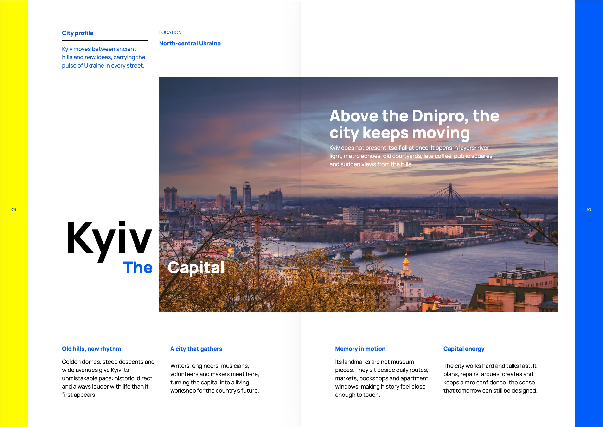
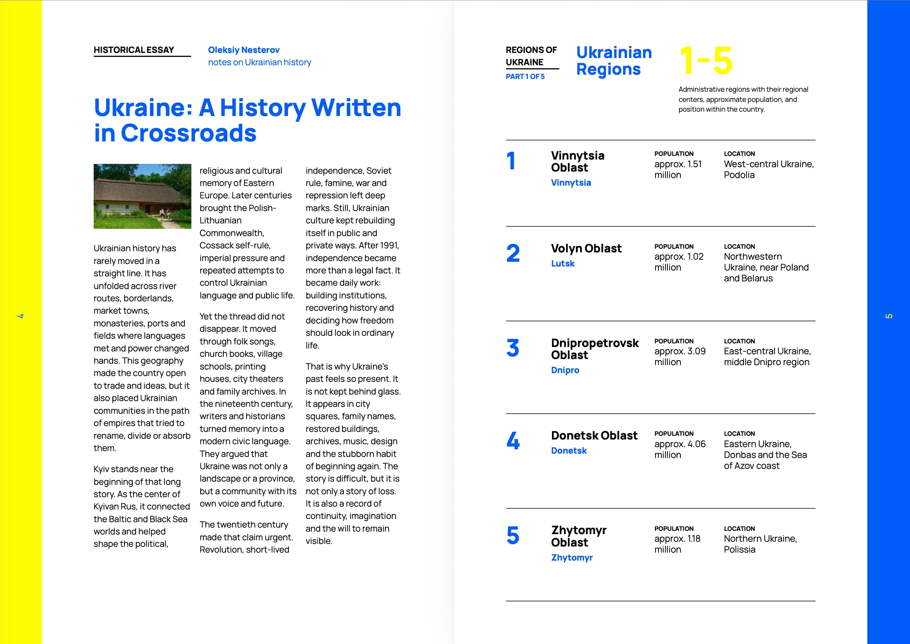
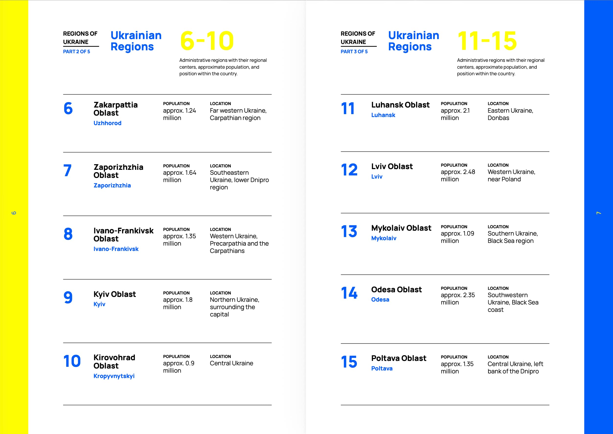
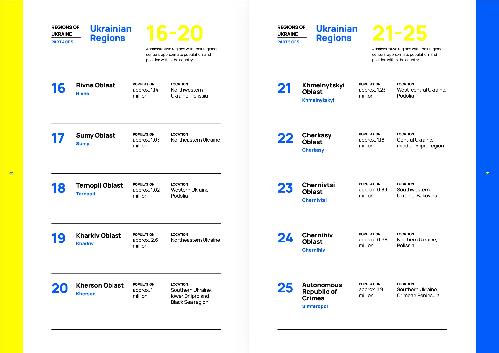
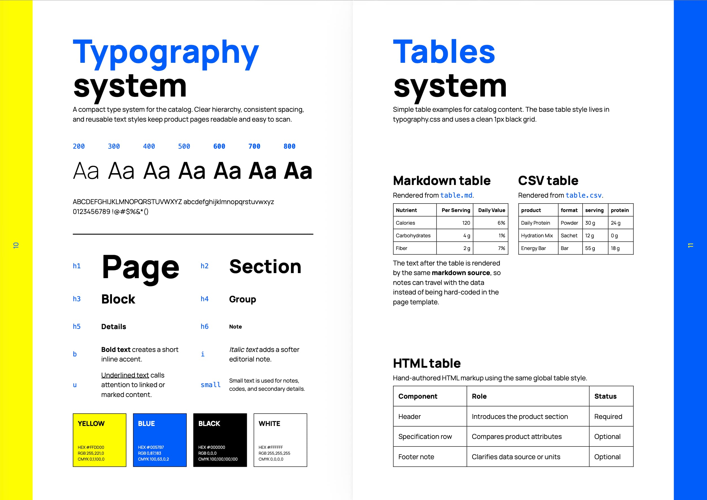

# Catalog Builder

Small TypeScript proof of concept for generating paginated publications as static web pages, a lightweight PDF and a print-oriented PDF through Vivliostyle. It can be used for product catalogs, magazines, brochures, card sets, editorial reports and other print-friendly web documents.

## Structure

- `src/` contains application code only.
- `catalogs/` contains one folder per catalog. Each catalog folder is its own root for pages, templates, styles and assets.
- `dist/` contains generated output only.

The `catalogs/default` catalog is an example catalog. It already includes a design system, flexible templates and a working content structure, so it can be used as a foundation for custom catalogs. For catalog authoring, page layout conventions, design-system usage and content structure, see [GUID.md](GUID.md).

## Demo Catalog

The `media/` folder contains preview pages from the demo catalog:

<p>
  
  
  
  
  
  
  
  
</p>

See [media/catalog-web.pdf](media/catalog-web.pdf) for an example generated demo catalog PDF.

## Commands

```bash
npm install
npm run setup:print
npm run build:web
npm run build:pdf
npm run build:print
npm run build
npm run build -- <your-catalog-folder>
npm run build:web -- <your-catalog-folder>
npm run dev
npm run dev -- <your-catalog-folder>
```

Output is written to:

- `dist/<your-catalog-folder>/web/`
- `dist/<your-catalog-folder>/pdf/catalog-web.pdf`
- `dist/<your-catalog-folder>/print/catalog-print.pdf`

By default, the project uses the catalog in the `default` folder. Pass another catalog folder name as the second CLI argument to build or preview it.

## Page Format

The current PDF page format is A4. If the catalog format changes, update all format-specific values together:

- `catalogs/<your-catalog-folder>/catalog.json`: change `paperSize`.
- `catalogs/<your-catalog-folder>/styles/pdf.css`: change `@page { size: A4; }`.
- `catalogs/<your-catalog-folder>/styles/pdf.css`: change `.page { height: 297mm; }` to the physical height of the new page format.

For example, A4 portrait uses `"paperSize": "A4"`, `size: A4` and `height: 297mm`. A different portrait format needs both the named page size and the matching physical height updated, otherwise PDF backgrounds and page-height layouts may not fill the page correctly.

## Live Preview

Run:

```bash
npm run dev
```

Then open:

- `http://localhost:5173/default/` for the whole catalog
- `http://localhost:5173/default/cover-front` for one page
- `http://localhost:5173/<your-catalog-folder>/<page-name>` for another catalog or page

The preview server renders from the current catalog files on each request and reloads the browser when files inside `catalogs/` change.

## Adding A Catalog Page

Create a folder in `catalogs/default/pages/`, add `index.html`, then add the folder id to `catalogs/default/catalog.json`.

```text
catalogs/default/pages/product-page/
├── index.html
├── data.json
├── description.md
└── assets/
```

The page index, page number and left/right side are computed from `catalog.json`; they are not stored in page files.
Templates can also read `page.target`, which is `web`, `pdf` or `print` for the current render.

Page templates are normal Nunjucks files. Use `template()` to render a reusable template by folder name:

```njk

{{ template('product-details', { data }) }}
```

`file()` reads from the folder of the current page or template. Markdown, CSV, JSON, text and local assets are resolved automatically by extension.

`styles.css` is optional and is included when the page template is used.
Use `:scope` when a local style must target the current page wrapper. For a page, `:scope` becomes `.<page-id>.page` in the generated output.

```css
:scope {
  page: full-page;
  border: 0;
}

:scope .logo {
  width: 10vh;
}
```

Selectors without `:scope` are left as written. This keeps local CSS predictable and makes cross-context rules explicit.

Use an empty string in `catalog.json` for blank pages:

```json
{
  "pages": ["cover-front", "", "about-page"]
}
```

Blank pages are rendered only in print PDF builds. Web pages and lightweight web PDF builds skip them, while the original page indexes and left/right classes of real pages stay unchanged.

## Templates

Templates live in `catalogs/default/templates/<template-name>/index.html`.

Pages and templates work the same way: both can read local files, resolve local assets and define local CSS. Reusable fragments are rendered with:

```njk
{{ template('product-card') }}
```

Pass local parameters as the second argument:

```njk
{{ template('page-number', { offset: -1 }) }}
```

The renderer creates a wrapper for reusable templates automatically. The wrapper class is the template folder name, so `template('page-number')` renders inside `.page-number`.

Use `:scope` in template styles when a rule should target that generated template wrapper. For a template, `:scope` becomes `.<template-name>` in the generated output.

```html
<span class="number-value">{{ page.index + offset }}</span>
```

```css
:scope {
  position: absolute;
}

:scope .number-value {
  display: block;
}

.page-right :scope .number-value {
  text-align: right;
}
```

## Markdown And CSV

Pages and templates can read files directly from their own folder:

```njk
{{ file('description.md') }}

  {{ row.code }}

```

There is no duplicate filename mapping in JSON.

## Assets

Local page and template assets are resolved relative to the current page or template folder:

```njk
{{ file('assets/chair-detail.jpg') }}
```

Global assets are resolved from the current catalog root's `assets/` folder:

```njk
{{ global.asset('logo.svg') }}
```

## TIFF Print Replacement

Do not create separate web and print image folders. Keep browser-friendly JPG/PNG files beside optional TIFF siblings.

For print builds, `chair.jpg` resolves to `chair.tiff` if it exists. Web and lightweight PDF builds keep the original JPG/PNG. The print build uses a temporary `dist/<your-catalog-folder>/.tmp/print/print-image-replacements.json` file with the discovered replacements, then removes `dist/<your-catalog-folder>/.tmp` after a successful build.

PDF builds use a temporary target-specific Vivliostyle config. Lightweight web PDF builds do not enable CMYK post-processing. Print PDF builds enable `pdfPostprocess.cmyk`, so `device-cmyk()` colors are carried into print output.

`npm install` runs `install-print-tools.mjs`. It installs missing print tools automatically when a supported package manager is available:

- macOS: Homebrew (`brew install ghostscript xpdf`)
- Windows: winget (`ArtifexSoftware.GhostScript` and `oschwartz10612.Poppler`)
- Windows fallback: Chocolatey (`ghostscript` and `poppler`) or Scoop (`ghostscript` and `poppler`)

- `ghostscript` provides `gs` for press-ready PDF/X post-processing and CMYK ink coverage checks.
- `xpdf` or `poppler` provides `pdffonts`, which `press-ready` uses to inspect and outline fonts.

Set `CATALOG_BUILDER_SKIP_PRINT_TOOLS=1` before `npm install` to skip system tool setup.

On Windows, if no package manager is available, install the tools manually and make sure `gswin64c`/`gswin32c` and `pdffonts` are available in `PATH`, then run:

```powershell
npm run setup:print
```

If Ghostscript (`gs`) and `pdffonts` are installed, the generated Vivliostyle config also enables `preflight: "press-ready-local"` for print-oriented PDF/X post-processing. Without those tools, the pilot still creates `dist/<your-catalog-folder>/print/catalog-print.pdf` and prints a console warning.
